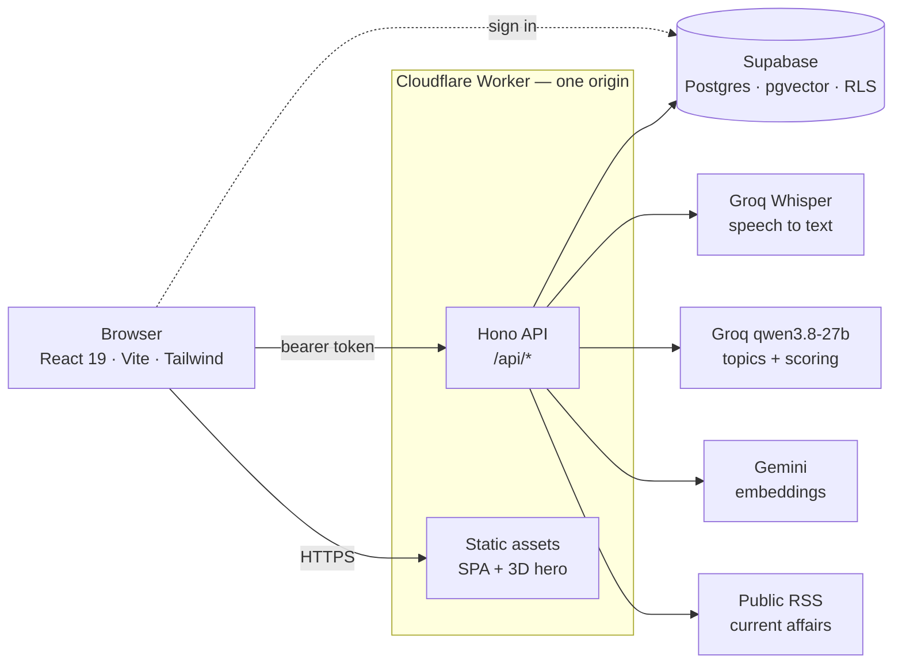
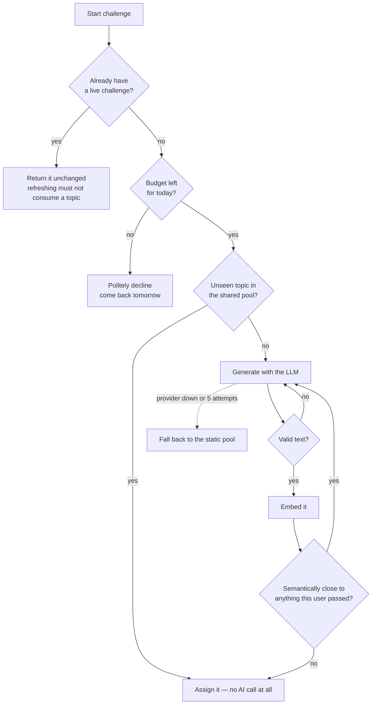

<div align="center">

# Jessica — The Communicator

**A speaking-practice app that hands you a topic you did not choose, starts a two-minute clock, and tells you how clearly you were actually understood.**

[**Live app**](https://jessica.ashutoshc.workers.dev) · [Specification](docs/SPEC.md) · [Licence](LICENSE)

[](LICENSE)
[](https://workers.cloudflare.com)
[](https://supabase.com)

</div>

---

You cannot prepare for it. That is the point — the skill being trained is thinking
and speaking under pressure, not rehearsing an answer.

1. **A topic arrives.** Generated on demand, and never one you have completed
   before. Not merely a different string: nothing *semantically equivalent* either.
2. **You talk.** Up to two minutes, recorded in the browser.
3. **You find out how it landed.** Fluency, coherence, vocabulary, relevance and
   structure, with written feedback and your transcript.

Pass or fail is decided by the backend, never by the model. The model supplies
measurements; the application applies the rules — minimum speaking duration
(measured from the audio itself, not self-reported by the browser), minimum
transcript length, minimum relevance.

## Contents

- [Architecture](#architecture)
- [How a topic is chosen](#how-a-topic-is-chosen)
- [Quick start](#quick-start)
- [Connecting a real backend](#connecting-a-real-backend)
- [Configuration](#configuration)
- [API](#api)
- [Testing](#testing)
- [Project structure](#project-structure)
- [Engineering notes](#engineering-notes)
- [Operating within free tiers](#operating-within-free-tiers)
- [Security](#security)
- [Roadmap](#roadmap)

## Architecture

One Cloudflare Worker serves both the API and the built frontend, so production is
a single origin and a single deployment.



The browser authenticates directly with Supabase and sends the resulting token to
the Worker, which verifies it and does all privileged work with a service-role key
the browser never sees. Row Level Security is the backstop: even with the public
anon key, a signed-in user can read only their own rows.

## How a topic is chosen

Cheapest path first, so AI quota is only spent when it has to be.



Current-affairs topics add a three-level retrieval strategy: no web call for any
other category, cached headlines from `topic_sources` while they are still fresh,
and only then a live RSS fetch. A dead or slow feed degrades to a topic generated
without current context rather than failing the request.

A provider outage is treated as a system failure, never a user failure. The
challenge stays available, no failed attempt is recorded, and the response is a
controlled "temporarily busy" rather than a stack trace.

## Quick start

Nothing to configure and no accounts needed — the app runs entirely on
`localStorage`:

```bash
git clone https://github.com/Ashutosh-Chaudhari/Jessica.git
cd Jessica
npm install
npm run dev          # http://localhost:5173
```

Node 22.18 or newer. The test suite runs TypeScript through `node --test` with
no build step, which relies on native type stripping.

## Connecting a real backend

### 1. Database

Create a free [Supabase](https://supabase.com) project, then apply the schema:

```bash
supabase link --project-ref YOUR-PROJECT-REF
supabase db push
```

Or paste the files in `supabase/migrations/` into the SQL editor **in filename
order**.

This creates `profiles`, `challenges` (with a 768-dimension pgvector column),
`user_challenges`, `attempts`, `ai_usage` and `topic_sources`; enables Row Level
Security on all of them; adds the trigger that creates a profile on signup; and
installs the `pick_unseen_challenge`, `is_duplicate_for_user`,
`user_progress_totals` and `delete_account` functions.

### 2. Frontend

`apps/web/.env.local`:

```ini
VITE_USE_MOCKS=false
VITE_SUPABASE_URL=https://YOUR-PROJECT.supabase.co
VITE_SUPABASE_ANON_KEY=your-anon-key
VITE_API_BASE_URL=http://localhost:8787
```

`apps/web/.env.production` is committed and overrides `VITE_API_BASE_URL` at build
time, because in production the Worker serves the app and the API from one origin.

The Supabase values are deliberately **not** committed, so a build on a machine
without `.env.local` has no backend configured. `vite build` refuses that
combination rather than silently shipping the mock app — a deployed site running
on `localStorage` looks completely normal while storing every signup in the
visitor's browser. In CI, pass them through the environment:

```bash
VITE_SUPABASE_URL=... VITE_SUPABASE_ANON_KEY=... npm run deploy
```

### 3. Worker

Set `SUPABASE_URL` in `apps/worker/wrangler.toml`, then supply the secrets. For
local development copy `apps/worker/.dev.vars.example` to `apps/worker/.dev.vars`.
For production:

```bash
npx wrangler secret put SUPABASE_SERVICE_ROLE_KEY --config apps/worker/wrangler.toml
npx wrangler secret put GROQ_API_KEY              --config apps/worker/wrangler.toml
npx wrangler secret put GEMINI_API_KEY            --config apps/worker/wrangler.toml
```

Keys come from the [Groq console](https://console.groq.com/keys) and
[Google AI Studio](https://aistudio.google.com/apikey). Both have free tiers.

```bash
npm run dev:worker   # http://localhost:8787
npm run dev          # http://localhost:5173, talking to the Worker
```

### 4. Deploy

```bash
npm run deploy
```

Builds the frontend and pushes one Worker that serves both it and the API.

## Configuration

### Worker variables — `apps/worker/wrangler.toml`

| Variable | Default | Purpose |
| --- | --- | --- |
| `SUPABASE_URL` | — | Your project URL. Public; it ships in the frontend anyway. |
| `AI_TEXT_PROVIDER` | `groq` | `groq` or `gemini`, for topics and scoring. |
| `GROQ_CHAT_MODEL` | `qwen/qwen3.8-27b` | Topic generation and scoring. |
| `GROQ_STT_MODEL` | `whisper-large-v3-turbo` | Speech to text. |
| `GEMINI_EMBEDDING_MODEL` | `gemini-embedding-001` | Semantic duplicate detection. |
| `GEMINI_MODEL` | `gemini-3.6-flash` | Only when `AI_TEXT_PROVIDER=gemini`. |
| `GEMINI_EVAL_MODEL` | `gemini-flash-lite-latest` | Only when `AI_TEXT_PROVIDER=gemini`. |
| `GEMINI_THINKING_LEVEL` | `low` | An empty string omits the field entirely. |
| `SIMILARITY_THRESHOLD` | `0.91` | Above this, a topic counts as already done. |
| `DAILY_AI_BUDGET` | `800` | Provider calls per UTC day, all users. `0` disables. |

### Worker secrets — `wrangler secret put`

| Secret | Required | Purpose |
| --- | --- | --- |
| `SUPABASE_SERVICE_ROLE_KEY` | yes | Privileged database access. Never sent to a browser. |
| `GROQ_API_KEY` | yes | Speech to text, topics, scoring. |
| `GEMINI_API_KEY` | yes | Embeddings. |
| `RESEND_API_KEY` | no | Owner notifications by email. |
| `NOTIFY_EMAIL_TO` | no | Where those emails go. |
| `NOTIFY_WEBHOOK_URL` | no | ntfy.sh, Discord or Slack instead of email. |
| `ALLOWED_ORIGIN` | no | Local dev only. Enables CORS; never set in production. |

### Frontend — `apps/web/.env.local`

| Variable | Purpose |
| --- | --- |
| `VITE_USE_MOCKS` | `true` runs entirely on `localStorage`. |
| `VITE_SUPABASE_URL` | Project URL. |
| `VITE_SUPABASE_ANON_KEY` | Public by design; RLS is what guards the data. |
| `VITE_API_BASE_URL` | Empty in production — same origin. |

## API

Every route requires a Supabase session token except `GET /api/health`.

| Method | Path | Purpose |
| --- | --- | --- |
| `GET` | `/api/health` | Liveness. The only unauthenticated route. |
| `GET` | `/api/auth/me` | The signed-in user. |
| `POST` | `/api/challenges/start` | Return the live challenge, or assign one. |
| `GET` | `/api/challenges/current` | The live challenge, or `null`. |
| `POST` | `/api/challenges/:id/submit` | `multipart/form-data` with `audio`. |
| `POST` | `/api/challenges/:id/retry` | Keep the topic, clear the failure. |
| `POST` | `/api/challenges/:id/skip` | Abandon the topic. |
| `GET` | `/api/history` | Every attempt, newest first. |
| `GET` | `/api/history/:id` | One attempt. |
| `GET` | `/api/progress` | Totals, streaks and per-dimension trends. |
| `GET` `PATCH` `DELETE` | `/api/profile` | Read, rename, or delete the account. |

Errors are always `{ "error": code, "message": text }` with a user-safe message.
Provider errors never reach the client.

## Testing

```bash
npm test          # domain logic, RSS parser, retry logic, budget, notifications
npm run typecheck # every workspace
npm run build     # frontend production build
```

38 tests, no framework — `node --test` against plain TypeScript. The suite covers
the pure logic where correctness is easy to get wrong and expensive to lose:
pass/fail rules, streaks and trends, semantic-duplicate normalisation, the RSS
parser, provider retry hints, the daily-budget boundary, and notification
delivery.

## Project structure

```
apps/
  web/                 React frontend
    public/            _headers, pre-paint theme script
    src/
      components/      Design primitives, the 3D hero, the clock
      content/         Written copy kept out of the components
      hooks/           Auth, theme, recorder
      pages/           One file per route
      services/        API contract, with HTTP and mock implementations
  worker/              Cloudflare Worker
    src/
      middleware/      Auth, security headers, per-request context
      routes/          Challenges, user
      services/        Topic engine, submit pipeline, news, notifications
      utils/           Errors, rate limits
packages/
  types/               Shared domain types, constants and pure logic
  ai/                  Provider interfaces + Groq and Gemini implementations
  database/            Supabase data access; all SQL lives behind functions
supabase/migrations/   Schema, RLS policies, RPCs
docs/SPEC.md           The original product and architecture specification
```

The frontend talks to a `JessicaApi` interface with two implementations — HTTP and
mock — so the UI never learns which backend it is using, and the whole app runs
with no accounts at all.

## Engineering notes

A few constants were measured against the live APIs rather than guessed.

**Similarity threshold — `0.91`.** Measured on real `gemini-embedding-001` output
at 768 dimensions: paraphrases of an already-completed topic score 0.956–1.000,
while genuinely different angles on the same subject score 0.699–0.872. The value
originally specified (0.85) sat inside the *accept* band and rejected the
specification's own test case — "Explain how GPS works" versus "Why was GPS
originally developed?", which scores 0.8656 and should be allowed through.

**Groq for topics and scoring.** Measured on identical transcripts:

| | requests/day | latency | on topic | off topic |
| --- | --- | --- | --- | --- |
| Groq `qwen3.8-27b` | 1000 | ~600 ms | relevance 100 | relevance 0 |
| Gemini `3.6-flash` | 20 | 5–10 s | relevance 98 | relevance 0 |

Same discrimination, fifty times the daily budget, an order of magnitude faster.
`AI_TEXT_PROVIDER` switches back without a code change, and both providers share
one prompt file so they cannot drift into scoring the same answer differently.

**Gemini is kept for embeddings only.** Groq publishes no embedding model, and
without embeddings there is no semantic duplicate detection — the feature that
stops the app handing you a paraphrase of a topic you already completed.

**No vector index.** PostgreSQL can only use an HNSW index for
`ORDER BY embedding <=> $1 LIMIT k`. Both consumers here use the operator as a
`WHERE` predicate, which no vector index can serve, so an index would cost write
time on every insert and never be read. Assignment cost is bounded instead by
shortlisting candidates before any vectors are compared.

**Duration comes from the audio.** Whisper reports the true length in
`verbose_json`; the browser's stopwatch is only a fallback for when the provider
returns none, and it is clamped. Pass or fail therefore cannot be gamed from the
client.

**Accessibility.** Every text colour in both themes is solved for a contrast ratio
of at least 7:1 (WCAG AAA) rather than the 4.5:1 AA floor. Fill colours and text
colours are separate design tokens, because a saturated red that reads well as a
10-pixel indicator is unreadable as a sentence.

## Operating within free tiers

The app is built to run at zero cost, which means treating quota as a real
engineering constraint.

- **Topic reuse is not an optimisation, it is what makes the product possible.** A
  topic generated once is served to every future user, so generation is amortised
  across the whole user base instead of costing a call per challenge.
- **A global daily cap** (`DAILY_AI_BUDGET`, default 800) stops the app before a
  provider does. Per-user hourly limits stop one person hammering the app; they do
  nothing about a hundred people each behaving reasonably. Once the day's budget
  is spent, starting and submitting return a plain "come back tomorrow" — reading
  history and progress still work, because they cost nothing.
- **The budget is claimed, not counted.** A request reserves its spend up front
  through a single locked `UPDATE`, then settles the reservation against what it
  actually cost — handing back the difference when a topic came from the pool and
  no provider was called at all. Counting past usage instead would not survive
  concurrency: usage rows are written after the response, so simultaneous
  requests would all read the same stale total and all be let through.
- **Every provider call is recorded** in `ai_usage` with its success flag, so it is
  possible to see exactly where the budget went.
- **Providers are replaceable.** Each capability sits behind an interface, so
  swapping one is a config change and an implementation file, not a rewrite.

### Owner notifications

Optionally get told the first time each new person uses the site:

| Channel | Configure | Needs |
| --- | --- | --- |
| Email | `RESEND_API_KEY` + `NOTIFY_EMAIL_TO` | a [Resend](https://resend.com) account |
| Phone push | `NOTIFY_WEBHOOK_URL` = `https://ntfy.sh/your-topic` | nothing at all |
| Discord / Slack | `NOTIFY_WEBHOOK_URL` = the webhook URL | a server or workspace |

```
Ada just started using Jessica.
12 people have signed up in total.
30 attempts today. 400/800 AI calls used today (50%)
```

Each ping doubles as a status report. Exactly one is sent per person, ever,
enforced by a single conditional update (`set notified_at = now() where id = $1
and notified_at is null`) — only one caller can match it, so concurrent requests
cannot both fire and no locking is needed. Delivery happens after the response via
`waitUntil`, and every failure is swallowed: a broken webhook must never break a
signup.

## Security

- **Row Level Security on every table.** The Worker uses a service-role key and
  bypasses RLS, so every data-layer function filters by `user_id` explicitly. RLS
  is the backstop for the public anon key: an anonymous caller reads nothing, and
  a signed-in user reads only their own rows.
- **Client privileges are granted, not merely policed.** Supabase grants every
  privilege on a new table to the public roles and leaves RLS to hold the line —
  and `TRUNCATE` ignores RLS entirely. So the grants are revoked and only
  `SELECT` is handed back, on the four tables whose read policies scope it to the
  caller. The browser writes nothing directly; every write goes through the
  Worker, which is why nothing is lost by taking the privilege away.
- **Secrets never reach the browser.** Only `VITE_`-prefixed variables are exposed;
  the anon key is safe there precisely because RLS guards the data.
- **HTTPS is enforced** with a 308 redirect that preserves method and body.
- **Security headers on every response** — a Content-Security-Policy with no
  `unsafe-inline` scripts, `X-Frame-Options: DENY`, `nosniff`, a referrer policy,
  HSTS, and a Permissions-Policy granting the microphone only to this origin while
  denying camera, geolocation, payment and USB.
- **CORS is off in production.** It exists only for split local development and is
  skipped entirely unless `ALLOWED_ORIGIN` is set.
- **Controlled errors only.** Provider responses, stack traces and SQL never reach
  a client.
- **Audio is not stored.** It is transcribed and discarded; the transcript and
  scores go when the account does.

## Roadmap

- Saving recordings to storage, if a user opts in.
- Per-dimension score charts beyond the current trend deltas.
- Social sign-in; email and password only for now.
- Gemini search grounding as a second current-affairs source — grounded requests
  return 429 on the free tier, so RSS is the only route for now.

## Background

The concept was inspired by a short video I came across online. Everything here —
the architecture, the code, the interface and the copy — is written from scratch.

## Licence

[MIT](LICENSE). Use it, change it, ship it; just keep the copyright notice.
