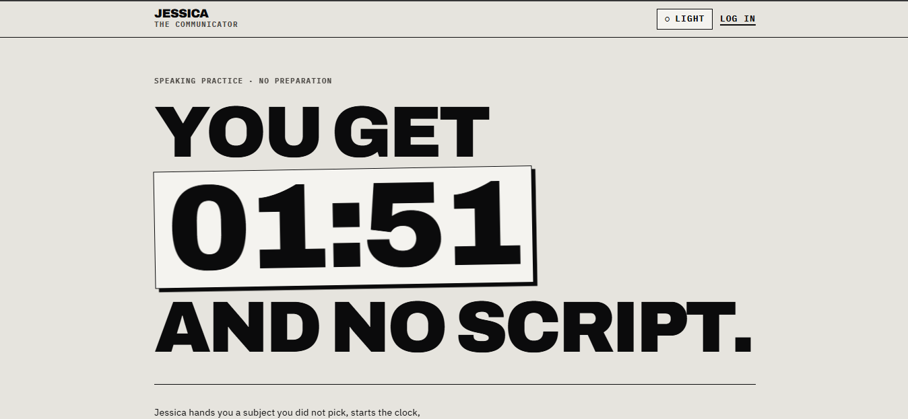
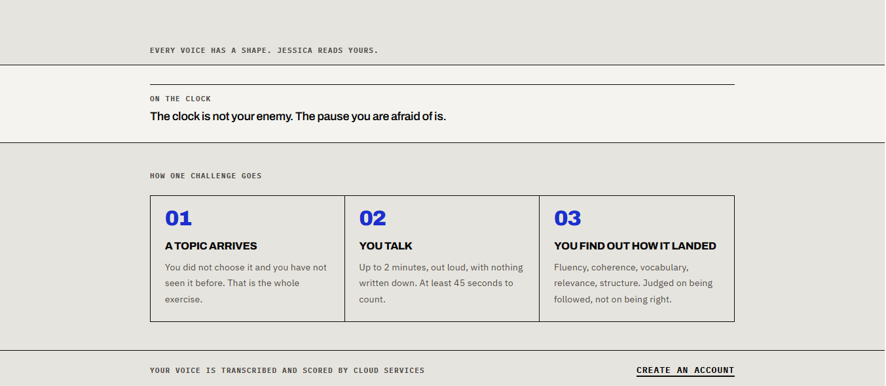
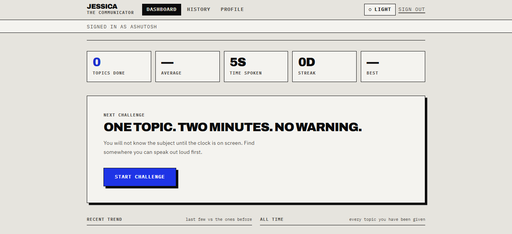
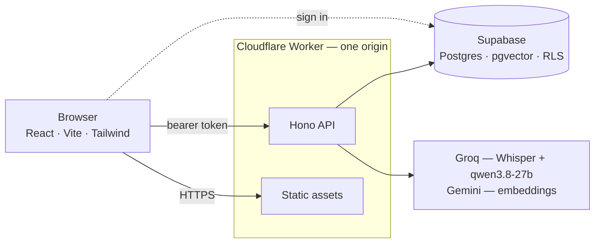

<div align="center">

# Jessica — The Communicator

### One unexpected topic. Two minutes. No script.

**[▶ Try it live](https://jessica.ashutoshc.workers.dev)**

[](LICENSE)
[](https://workers.cloudflare.com)
[](https://supabase.com)
[](https://react.dev)

</div>



A speaking-practice app that hands you a topic you did not choose, starts a
two-minute clock, and tells you how clearly you were actually understood.

You cannot prepare for it. That is the point — the skill being trained is
thinking and speaking under pressure, not rehearsing an answer.



Topics are never repeated, and not just as strings: a new topic is embedded and
compared against everything you have already passed, so you never get a
paraphrase of a subject you have done. Pass or fail is decided by the backend,
never by the model — the model measures, the application judges.



## Quick start

No accounts, no API keys, no backend — the app runs entirely on `localStorage`:

```bash
git clone https://github.com/Ashutosh-Chaudhari/Jessica.git
cd Jessica
npm install
npm run dev          # http://localhost:5173
```

Needs Node 22.18+ (the tests run TypeScript through `node --test`, with no build
step). To point it at a real backend, open **Setup** below.

## How it works

One Cloudflare Worker serves both the API and the built frontend, so production
is a single origin and a single deployment.



The browser authenticates with Supabase and sends the token to the Worker, which
verifies it and does all privileged work with a service-role key the browser
never sees. Row Level Security is the backstop.

## Decided by measurement, not by guesswork

**The duplicate threshold is 0.91**, not the 0.85 originally specified. Measured
on real embeddings: paraphrases of a completed topic score 0.956–1.000, while
genuinely different angles on the same subject score 0.699–0.872. The original
value sat inside the accept band and rejected its own test case.

**Topics and scoring run on Groq, not Gemini.** Same discrimination on identical
transcripts, 50× the daily free quota, and an order of magnitude faster:

| | requests/day | latency | on topic | off topic |
| --- | --- | --- | --- | --- |
| Groq `qwen3.8-27b` | 1000 | ~600 ms | relevance 100 | relevance 0 |
| Gemini `3.6-flash` | 20 | 5–10 s | relevance 98 | relevance 0 |

Gemini is kept for embeddings alone, because Groq publishes no embedding model.

**There is no vector index**, deliberately. Postgres can only use HNSW for
`ORDER BY embedding <=> $1 LIMIT k`; both consumers here use the operator as a
`WHERE` predicate, which no vector index can serve. It would cost write time on
every insert and never once be read.

**Duration comes from the audio**, not the browser's stopwatch, so pass or fail
cannot be gamed from the client.

## Running free without falling over

- **Reusing topics is what makes the product possible.** A topic generated once
  is served to every future user, so generation amortises across the whole user
  base instead of costing a call per challenge.
- **A global daily cap stops the app before a provider does.** It is *claimed*,
  not counted: a request reserves its spend through one locked `UPDATE`, then
  settles against real cost — handing the budget back when a topic came from the
  pool and no provider was called. Counting past usage would not survive
  concurrency. Once spent, the app says "come back tomorrow"; history and
  progress still work, because they cost nothing.
- **Optional owner notifications** tell you the first time each new person uses
  the site, by email, phone push, or webhook. Exactly one per person, ever.

## Security

- Row Level Security on every table, with the Worker filtering by `user_id`
  explicitly on top of it.
- Client roles are granted only `SELECT`, rather than left with Supabase's
  default of everything — `TRUNCATE` ignores RLS.
- HTTPS enforced by redirect; CSP, HSTS, `frame-ancestors 'none'` and a
  microphone-only Permissions-Policy on every response.
- CORS is off in production. Secrets never reach the browser. Audio is never
  stored — it is transcribed and discarded.

<details>
<summary><strong>Setup</strong></summary>

### 1. Database

Create a free [Supabase](https://supabase.com) project, then apply the schema,
its RLS policies and its functions:

```bash
supabase link --project-ref YOUR-PROJECT-REF
supabase db push
```

Or paste the files in `supabase/migrations/` into the SQL editor, in filename
order.

### 2. Frontend — `apps/web/.env.local`

```ini
VITE_USE_MOCKS=false
VITE_SUPABASE_URL=https://YOUR-PROJECT.supabase.co
VITE_SUPABASE_ANON_KEY=your-anon-key
VITE_API_BASE_URL=http://localhost:8787
```

These are deliberately not committed, so a build on a machine without them has
no backend configured — and `vite build` refuses that rather than silently
shipping the mock app, which looks completely normal while storing every signup
in the visitor's browser. In CI, pass them through the environment.

### 3. Worker

Set `SUPABASE_URL` in `apps/worker/wrangler.toml`, then add the secrets. Keys
come from the [Groq console](https://console.groq.com/keys) and
[Google AI Studio](https://aistudio.google.com/apikey); both are free.

```bash
npx wrangler secret put SUPABASE_SERVICE_ROLE_KEY --config apps/worker/wrangler.toml
npx wrangler secret put GROQ_API_KEY              --config apps/worker/wrangler.toml
npx wrangler secret put GEMINI_API_KEY            --config apps/worker/wrangler.toml
```

For local development, copy `apps/worker/.dev.vars.example` to
`apps/worker/.dev.vars` instead, then:

```bash
npm run dev:worker   # :8787
npm run dev          # :5173, talking to the Worker
npm run deploy       # builds the app and ships one Worker serving both
```

</details>

<details>
<summary><strong>Configuration</strong></summary>

**Worker variables** — `apps/worker/wrangler.toml`

| Variable | Default | Purpose |
| --- | --- | --- |
| `SUPABASE_URL` | — | Your project URL. Public; it ships in the frontend anyway. |
| `AI_TEXT_PROVIDER` | `groq` | `groq` or `gemini`, for topics and scoring. |
| `GROQ_CHAT_MODEL` | `qwen/qwen3.8-27b` | Topic generation and scoring. |
| `GROQ_STT_MODEL` | `whisper-large-v3-turbo` | Speech to text. |
| `GEMINI_EMBEDDING_MODEL` | `gemini-embedding-001` | Semantic duplicate detection. |
| `GEMINI_MODEL` | `gemini-3.6-flash` | Only when `AI_TEXT_PROVIDER=gemini`. |
| `GEMINI_EVAL_MODEL` | `gemini-flash-lite-latest` | Only when `AI_TEXT_PROVIDER=gemini`. |
| `GEMINI_THINKING_LEVEL` | `low` | An empty string omits the field entirely. |
| `SIMILARITY_THRESHOLD` | `0.91` | Above this, a topic counts as already done. |
| `DAILY_AI_BUDGET` | `800` | Provider calls per UTC day, all users. `0` disables. |

**Worker secrets** — `wrangler secret put`

| Secret | Required | Purpose |
| --- | --- | --- |
| `SUPABASE_SERVICE_ROLE_KEY` | yes | Privileged database access. Never sent to a browser. |
| `GROQ_API_KEY` | yes | Speech to text, topics, scoring. |
| `GEMINI_API_KEY` | yes | Embeddings. |
| `RESEND_API_KEY` + `NOTIFY_EMAIL_TO` | no | Owner notifications by email. |
| `NOTIFY_WEBHOOK_URL` | no | ntfy.sh push, or Discord/Slack, instead of email. |
| `ALLOWED_ORIGIN` | no | Local dev only. Enables CORS; never set in production. |

**Frontend** — `apps/web/.env.local`: `VITE_USE_MOCKS`, `VITE_SUPABASE_URL`,
`VITE_SUPABASE_ANON_KEY`, `VITE_API_BASE_URL` (empty in production — same origin).

</details>

<details>
<summary><strong>API</strong></summary>

Every route requires a Supabase session token except `GET /api/health`.

| Method | Path | Purpose |
| --- | --- | --- |
| `GET` | `/api/health` | Liveness. The only unauthenticated route. |
| `GET` | `/api/auth/me` | The signed-in user. |
| `POST` | `/api/challenges/start` | Return the live challenge, or assign one. |
| `GET` | `/api/challenges/current` | The live challenge, or `null`. |
| `POST` | `/api/challenges/:id/submit` | `multipart/form-data` with `audio`. |
| `POST` | `/api/challenges/:id/retry` | Keep the topic, clear the failure. |
| `POST` | `/api/challenges/:id/skip` | Abandon the topic. |
| `GET` | `/api/history` · `/api/history/:id` | Attempts, newest first. |
| `GET` | `/api/progress` | Totals, streaks and per-dimension trends. |
| `GET` `PATCH` `DELETE` | `/api/profile` | Read, rename, or delete the account. |

Errors are always `{ "error": code, "message": text }` with a user-safe message.
Provider errors never reach the client.

</details>

<details>
<summary><strong>Project layout &amp; testing</strong></summary>

```
apps/web/         React frontend — components, pages, hooks, services
apps/worker/      Cloudflare Worker — middleware, routes, services, utils
packages/types/   Shared domain types, constants and pure logic
packages/ai/      Provider interfaces + Groq and Gemini implementations
packages/database/  Supabase data access; all SQL behind functions
supabase/migrations/  Schema, RLS policies, RPCs
docs/SPEC.md      The original product and architecture specification
```

The frontend talks to a `JessicaApi` interface with two implementations, HTTP
and mock, so the UI never learns which backend it is using.

```bash
npm test          # 38 tests, node --test, no framework
npm run typecheck
npm run build
```

The suite covers the pure logic where correctness is easy to lose: pass/fail
rules, streaks and trends, duplicate normalisation, the RSS parser, provider
retry hints, the daily-budget boundary under concurrency, and notifications.

</details>

## Background

The concept was inspired by a short video I came across online. Everything
here — the architecture, the code, the interface and the copy — is written from
scratch.

## Licence

[MIT](LICENSE). Use it, change it, ship it; just keep the copyright notice.
